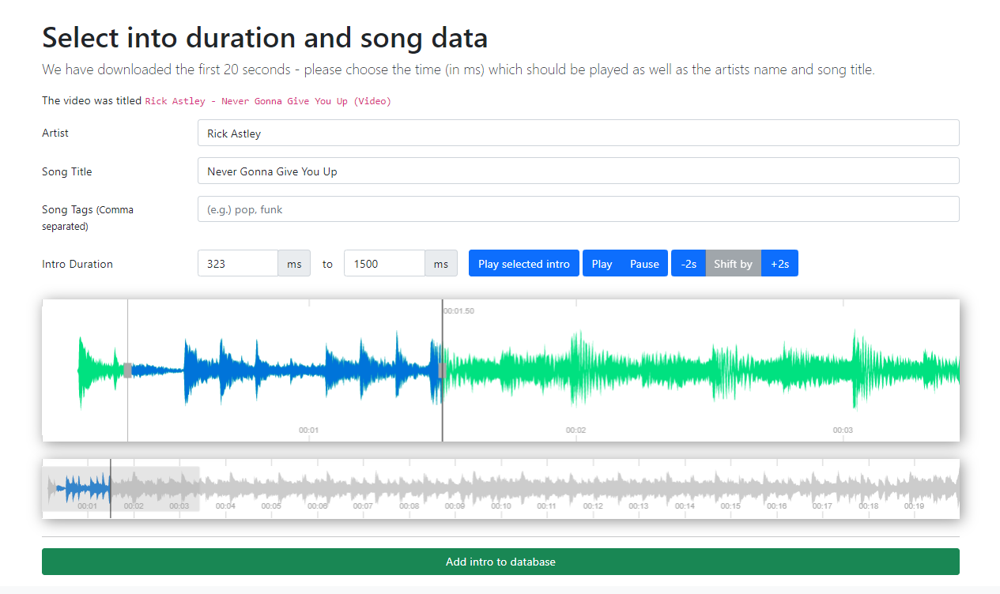

This project was started on a whim because the first page of google did not show something similar
(most likely for copyright reasons).

The code quality is ... not great, but it works.

Adding a new song is possible with a really fancy UI (I am surprised myself)

## Setup

I've included an example docker setup using [traefik](https://doc.traefik.io/traefik/) as a reverse proxy.

Just serve the public dir and host the python based server (`server.py`) for the websocket. And make sure the python
server is able to download videos into the public dir, if wanted.

Just setup an instance, tell your friends the url, fill it with songs, and have fun.

## With special thanks to

* [Matt Gray](https://twitter.com/MattGrayYES) for the motivation of writing this
* BBC R&D for their [peak.js](https://github.com/bbc/peaks.js/) library
